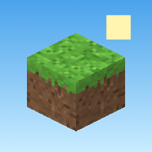

# JippeCraft

Een Minecraft-achtig bouwspel voor Jippe (6 jaar). Het draait in Safari op de iPad
en je hoeft niets te installeren. Het plan staat in [`PLAN.md`](PLAN.md); plannen en prompts
voor de volgende stappen staan in [`docs/`](docs/README.md).

**Speel online:** https://mscheltens83.github.io/Jippe_minecraft/



## Hoe speel je?

| Wat | Hoe |
|---|---|
| **Lopen** | Duim linksonder neerzetten en schuiven (joystick) |
| **Rondkijken** | Met je vinger over het scherm vegen |
| **Bouwen** | Groene knop bovenin aan, dan op een blok tikken. Het nieuwe blok komt tegen dat vlak aan |
| **Toren bouwen** | Recht naar beneden kijken en op de grond onder je tikken: je wipt vanzelf op het nieuwe blok |
| **Slopen** | Rode knop (houweel) bovenin aan, dan je vinger op een blok **vasthouden** tot het rondje vol is. Blijf je vasthouden, dan graaf je verder |
| **Blok kiezen** | Tik op een blok in de onderbalk. De kist rechts heeft vier tabbladen: Blokken, Natuur, Stempels en Dieren |
| **Natuur** | Kies junglehout, lianen, bamboe, cactussen, palmen, ijs of savannegras uit de kist. De plaatjes staan per wereld bij elkaar |
| **Stempels** | Kies een huisje, boom, toren, brug, iglo, piramide, tempel of leeuwenrots uit de kist en tik op de grond. Het staat er in één keer |
| **Dieren** | Varkens, kippen, schapen en 24 wilde diersoorten lopen rond. De dierenkist groepeert hun plaatjes per wereld. Kies een dier en tik op de grond om het neer te zetten |
| **Aaien** | Tik op een dier: hartjes, een eigen geluid en een kunstje. Leeuwen schudden hun manen, de olifant spuit water en het nijlpaard gaapt |
| **Wilde dieren** | Jungle: tijger, aap, papegaai, panda, kikker en luiaard. Woestijn: stokstaartje, kameel, woestijnvos, hagedis en schildpad. Toendra: ijsbeer, pinguïn, rendier, poolvos, zeehond en sneeuwuil. Ook de savanne zit vol dieren |
| **Deur** | Tik op een deur om hem open of dicht te doen |
| **Stal** | Bouw een hek met hekdeur om je varkens, kippen en schapen. Tik op de hekdeur om hem open of dicht te doen. Een hooibaal houdt de boerderijdieren in de buurt |
| **Roofdieren** | Leeuwen, leeuwinnen, cheetahs en tijgers jagen soms op boerderijdieren. Je ziet eerst een ! boven de prooi en kunt het roofdier aaien om de jacht te stoppen. In het menu kunnen ouders ‘Roofdieren jagen’ uitzetten |
| **Vriendjes-leeuw** | Aai dezelfde leeuw of leeuwin drie keer snel achter elkaar. Het rode zadel laat zien dat jullie vrienden zijn; hij volgt je en jaagt niet meer |
| **Rijden** | Tik nog eens op je vriendjes-leeuw om op te stappen. Duw de joystick helemaal naar voren om te rennen, spring over een hek en tik op het leeuw-pijltje om af te stappen |
| **Vuurwerk** | Zet een vuurwerkblok neer en tik erop |
| **Stuiterblok** | Spring erop en je stuitert hoog de lucht in |
| **Springen** | Grote pijl rechtsonder. Tegen een opstapje of trap lopen gaat vanzelf |
| **Vliegen** | Veertje-knop. Pijl omhoog en omlaag om te stijgen en te dalen |
| **Poppetje** | Knop rechtsboven: de camera gaat achter je hangen, zodat je jezelf ziet |
| **Oeps!** | De terug-pijl rechtsboven zet de laatste acties terug (ook een hele stempel) |
| **IJs** | Op ijs en pakijs glijd je nog even door als je de joystick loslaat |
| **Modder** | Op modder loop je langzamer |
| **Lianen** | Vooruit tegen een liaan of de springknop klimt omhoog. Laat los om te blijven hangen. De omlaagknop laat je zakken |
| **Menu** | Huisje linksboven: geluid, muziek en de zes wereldplekken |

In het menu onder **Werelden** staan zes plekken in twee rijen, elk met een plaatje van je wereld.
Tik op een wereld om erheen te gaan, op een lege plek (+) om een nieuwe te maken,
of op het rondje-pijltje om een wereld opnieuw te beginnen (dat vraagt eerst of je het zeker weet).
Je kiest uit **Eiland, Plat, Jungle, Woestijn, Toendra, Savanne en Avontuur**.
In Avontuur liggen de vier nieuwe landschappen rondom een centrale weide.
Zoek een tempel, piramide, iglo, leeuwenrots, drinkplaats of oase. De bouwplek in het
midden blijft vlak. Schatkisten zijn er al; de verrassing bij het openen volgt later.
Een leeuw luiert op de leeuwenrots, cheetahs sprinten met stofwolkjes en tijgers zwemmen.
Giraffen eten bij acacia's, zebra's zoeken elkaar op en stokstaartjes duiken weg als je ze aait.
Papegaaien en sneeuwuilen vliegen, apen en luiaards klimmen, pinguïns glijden over ijs
en panda's zoeken bamboe. Tik op een dier om zijn eigen geluid en kunstje te zien.
Nieuwe dieren verschijnen vanzelf in een **nieuwe** wereld. Bewaarde werelden behouden
hun dieren; daar kun je de nieuwe soorten zelf uit de kist neerzetten.

Op een computer werkt het ook: **WASD** of pijltjes lopen, **slepen** met de muis kijkt rond,
**klikken** bouwt (in de sloop-stand: muisknop vasthouden), **rechtermuisknop** doet het omgekeerde,
**spatie** springt, **Shift** daalt, **F** vliegen, **C** poppetje, **M** muziek, **E** kist,
**Q** wisselen tussen bouwen en slopen, **1–9** blok kiezen, **Ctrl+Z** terug, **Esc** menu.

### Veilig voor kinderen
- Geen monsters of schade aan de speler; de speler heeft geen honger. Altijd dag. Een gevangen boerderijdier verdwijnt in een vriendelijke poef en kan meteen opnieuw uit de kist worden geplaatst.
- Je kunt niet uit de wereld vallen (onbreekbare bodem, onzichtbare rand).
- Slopen moet je even vasthouden, dus je sloopt niet per ongeluk je huis.
- De werelden worden vanzelf bewaard. Een wereld weggooien vraagt altijd eerst om bevestiging.
- Geen reclame, geen internet nodig tijdens het spelen, geen gegevens die ergens heen gaan.

### Op een oudere iPad
Het spel begint op een tablet iets minder scherp en past zich aan: haalt de iPad het niet,
dan tekent hij nog wat minder scherp; is de iPad snel, dan juist scherper.

## Op de iPad zetten

Het spel bestaat uit gewone webbestanden. Het moet op een website staan (via `https://`).

### Optie 1: claude.ai-link (snelst)
Open de link naar het JippeCraft-artifact op de iPad in Safari (log in op claude.ai).
De wereld wordt daar ook in de artifact-database bewaard.
Zie je "This browser isn't supported"? Dan is Safari te oud voor claude.ai: werk de iPad bij
(Instellingen → Algemeen → Software-update) of gebruik optie 2. Het spel zelf werkt vanaf iPadOS 15.

### Optie 2: als echte app op het beginscherm (aanrader)
1. Zet de bestanden op een gratis webhost, bijvoorbeeld:
   - **GitHub Pages**: kan bij een privé-repository alleen met een betaald GitHub-abonnement.
     Anders de repository openbaar maken. Daarna: *Settings → Pages → Deploy from a branch →*
     kies de branch met het spel en map `/ (root)`. Na een minuutje staat het op
     `https://mscheltens83.github.io/Jippe_minecraft/`.
   - **Netlify Drop** (<https://app.netlify.com/drop>): sleep de hele map erin.
   - **Cloudflare Pages**: koppel de repository.
2. Open de website op de iPad in **Safari**.
3. Tik op **Deel** (vierkantje met pijl) → **Zet op beginscherm**.
4. Nu staat er een JippeCraft-icoon. Het opent schermvullend en werkt ook zonder internet.

> Tip voor ouders: met **Begeleide toegang** (Instellingen → Toegankelijkheid) kun je de
> iPad vastzetten in het spel.

## Zelf aanpassen / testen

Geen bouwstap nodig: het zijn gewone HTML-, CSS- en JavaScript-bestanden.

```bash
npm start          # start een lokale webserver op http://localhost:8080
npm install        # eenmalig, voor de test
npm test           # speelt het spel automatisch in een gesimuleerde iPad
npm run icons      # maakt de app-iconen opnieuw
```

### Bestanden
| Bestand | Wat doet het? |
|---|---|
| `index.html` | De startpagina |
| `artifact.html` | Dezelfde pagina, maar dan voor een claude.ai-artifact |
| `css/style.css` | De opmaak van knoppen en menu's |
| `js/main.js` | Opstarten, de spel-lus, bouwen en slopen |
| `js/blocks.js` | Alle bloktypes (hier kun je blokken toevoegen) |
| `js/textures.js` | De pixel-art texturen, getekend met code |
| `js/world.js` | De zeven wereldsoorten maken, bewaren en laden |
| `js/biomes.js` | Landschap, bomen, planten, lucht en mist per wereld |
| `js/structures.js` | Tempels, piramides, iglo's, leeuwenrotsen, drinkplaatsen en oases |
| `js/mesher.js` | Blokken omzetten naar 3D-vlakken, met zachte schaduwen |
| `js/scene.js` | Lucht, zon, wolken en de zee rondom |
| `js/player.js` | Lopen, springen, vliegen, zwemmen en botsen |
| `js/raycast.js` | Welk blok tik je aan? |
| `js/input.js` | Touch, muis en toetsenbord |
| `js/ui.js`, `js/icons.js` | Knoppen, onderbalk, kist en menu |
| `js/audio.js` | Zelfgemaakte geluidjes (ook dierengeluidjes en vuurwerk) |
| `js/music.js` | Het rustige muziekje, met code gemaakt |
| `js/animals.js` | Dieren per wereld neerzetten, aantikken, bewaren en laden (maximaal 60) |
| `js/animals/` | Recepten, gedeelde 3D-figuren, beweging, slapen, zwemmen, sprinten en kunstjes |
| `js/avatar.js`, `js/models.js` | Het poppetje en de blokkige figuurtjes |
| `js/stamps.js` | De stempels: huisje, boom, toren en brug |
| `js/particles.js` | Brokjes, vuurwerk, hartjes, glitters, Zzz, stof en waterdruppels |
| `js/storage.js` | Bewaren van de zes werelden in de browser (en op claude.ai in de database); oude opslag blijft werken |
| `sw.js`, `manifest.webmanifest` | Offline spelen en "zet op beginscherm" |
| `lib/three.module.min.js` | [Three.js](https://threejs.org) r170 (MIT-licentie), voor de 3D-weergave |

### Een blok toevoegen
1. Teken een textuur in `js/textures.js` (een functie in `GEN`, 16×16 pixels).
2. Voeg het blok toe in `js/blocks.js` met `def(...)` en zet het in `PALETTE_GROUPS`.

### Een stempel toevoegen
Schrijf in `js/stamps.js` een nieuw stuk bij `buildStamp` (met `put(links, omhoog, vooruit, blok)`),
voeg in `js/blocks.js` een regel toe aan `ITEM` en `SPECIALS`, en geef het een plaatje in `js/icons.js`.
